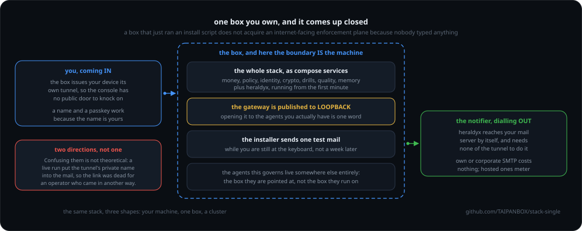

# The agent stack on one machine

One command puts the whole governed stack on a box you own, ready for agents
that live somewhere else entirely.

```bash
curl -fsSL https://raw.githubusercontent.com/TAIPANBOX/stack-single/main/install.sh | bash
```

<div align="center">



</div>

It comes up closed. The gateway is published to the host's **loopback**, so a
box that just ran an install script does not acquire an internet-facing
enforcement plane because nobody typed anything. Opening it to the agents you
actually have is one word:

```bash
GATEWAY_BIND=0.0.0.0 ./install.sh
```

Then point an agent at the gateway. Wherever that agent runs, in EKS, in a CI
job, on a laptop, its calls are metered, budgeted and policy-checked:

```bash
ANTHROPIC_BASE_URL=http://<your box>:4100
```

On a box that is already installed, edit `GATEWAY_BIND` in
`/opt/agent-stack/.env` and `docker compose up -d`. Re-running the installer
will NOT widen it: `.env` is left alone once it exists, which is the same
property that stops a re-run rotating your credentials.

## This is not the sandbox

[`stack-up`](https://github.com/TAIPANBOX/stack-up) is the local try: it binds
`127.0.0.1` on purpose, needs Rust, Go and Node on your machine, and stops when
you press Ctrl-C. It says as much about itself, and it is right to.

This is the other thing. The differences are the whole point:

| | `stack-up` | here |
|---|---|---|
| Reachable by an agent elsewhere | no, and it cannot be | yes, one variable away |
| Toolchains on your host | Rust, Go, Node, Python | docker and git |
| Where the planes come from | compiled on your machine | pulled from ghcr.io, pinned |
| Survives a reboot | no | yes |
| Console sign-in | no console at all | generated, shown once |
| Credentials | a dev key | unique per box, 0600, never printed twice |
| Governance routines on a schedule | all five, as OS timers | none, see below |

## What this box does not run

Two things a look at `compose.yaml` alone will not tell you, both about
absence rather than presence. An operator choosing between the three
deployment shapes (`stack-up`, this one, `stack-k8s`) should be able to see
both before installing, not after.

**No governance routines run on a schedule.** `stack-up`'s `routines.sh`
installs five OS-native timers for the stack's own recurring governance work:
a FinOps export, a crypto-inventory trend, a quality-drift check, an
identity-anomaly sweep, and an opt-in fire drill. `stack-k8s` runs three of
those as CronJobs (`crypto-trend`, `quality-drift`, `identity-sweep`; its own
docs explain why the fourth, the FinOps export, cannot run as a CronJob
there). Neither `install.sh` nor `compose.yaml` installs anything of the
kind: this box runs **none of the five, ever, on its own.** Run one by hand
inside the console container when you want it:

```bash
docker compose exec console verdryx drift --baseline <id>   # or qryx, ...
```

One of the five is defined here as a service you START rather than one that
loops, because a loop is impossible for it and not merely unwanted. The identity
sweep runs on the idryx image, which is distroless: there is no shell for a
`sleep` loop, the binary is `/usr/local/bin/service` rather than `idryx`, and
`detect` has no `--interval`. So it takes the shape stack-k8s already uses for
the one job that must never start because a manifest was applied, and a person
runs it:

```bash
docker compose run --rm idryx-detect
```

It sits behind a `manual` profile that no install enables, which
`scripts/manifest-is-true.sh` checks in both halves: the profile has to be there,
and `install.sh` must never pass it. Put that line in your own cron if you want
it hourly.

or add your own cron entry on the host calling `docker compose exec`. This
was not a documented choice before now; it is simply what the installer and
the compose file do, and it is worth knowing before you pick this shape over
the other two.

**The memory plane, `engram`, is not a separate service here**, the same way
`verdryx`, `qryx` and `mockryx` are not: `compose.yaml` names no `engram`,
`verdryx`, `qryx` or `mockryx` container, because none of the four is meant
to be one. `stack-k8s`'s own README explains why (its "Fact 2"): the console
reaches each of them by EXECUTING it, or, for `engram-mcp` specifically, by
speaking MCP over stdio to a child process, and "a sidecar container cannot
be another container's stdin." So all four have to live inside the console's
own image or not run at all.

They do live there. `install.sh` clones `verdryx` and `engram` as sources
(the same `for r in ... verdryx engram` loop that clones every other plane,
above) and builds the console from the identical
`stack-k8s/images/console.Dockerfile` that bakes both into `stack-k8s`'s
console image, the same `pip install` step and all. Based on reading that
build, not on having run it: the underlying binaries appear to be present
here exactly the way they are in `stack-k8s`'s console, which is a different
claim from "the memory plane works here", and both stacks share the same
further gate regardless of deployment shape: `genaryx`'s own discovery code
(`memory/env.rs`) refuses to show a Memory panel until its store already has
a file with real data in it, so a console that has never actually run an
Engram session reports "no memory plane" on `stack-up`, here, and on
`stack-k8s` alike, until an operator does something once. If there is a
concrete reason this box's memory plane cannot work that a closer look would
find, it is not in `install.sh`, `compose.yaml`, or the Dockerfile it builds
from.

## Reaching the console: this box issues your device its own tunnel

The console is on loopback, so it is reached over a tunnel rather than exposed.
This box runs the WireGuard side itself: sign in, open Remote, and it mints
your laptop or phone a peer config as a QR. Scan, connect, and the console
answers over HTTPS on the name it was configured with, inside that tunnel and
nowhere else - see the next section, because that name is not optional if you
want passkeys to work at all.

Issuing a device and revoking one both require a passkey, the same ceremony a
kill, a budget change or an approval decision does: a peer config is a road
into the control plane, so a stolen console session must not be able to mint
one quietly. Your first device is issued by `install.sh` itself, not the
browser: a passkey cannot be enrolled before a tunnel exists, so the browser
has nothing to issue the first device from. Every device after that goes
through the console once you have one.

The sequence for your first session:

1. import the `.conf` file `install.sh` printed the path to (or scan the QR
   it printed on that run) into your WireGuard client, and connect
2. open `https://<your CONSOLE_DOMAIN>`, trusting this box's own CA first if
   you did not set `CLOUDFLARE_API_TOKEN` (see the next section)
3. sign in with the password `install.sh` printed
4. enrol a passkey under Session > Passkeys

Only after step 4 do kill, budget, approval and device commands work.

SSH is still how you read the console before the tunnel exists, not how you
act on it: a passkey cannot be enrolled over an SSH forward, because WebAuthn
checks the origin, and that forward is `http://localhost`, never your console
domain.

```bash
ssh -L 17420:127.0.0.1:7420 root@<your box>
```

**Alerts do not need any of this.** The notifier dials outward to your mail
server; the tunnel exists to let you IN. A box with no tunnel and no device
still writes to you when one of your agents crosses a line. What the tunnel
decides is only whether the one link in that mail can be opened.

So the link is settable, in `.env`:

```
ALERT_CONSOLE_URL=''                        # use CONSOLE_DOMAIN, i.e. the tunnel
ALERT_CONSOLE_URL='http://localhost:17420'  # you reach the console over ssh -L
```

Leave it empty with no tunnel either, and the mail says it carries no link
rather than carrying a dead name.

Two details worth knowing rather than discovering:

- `51820/udp` is published, and it is the one port here that has to be. Unlike
  an HTTP plane, WireGuard answers nothing at all without a valid key: no
  banner, no handshake, nothing for a scanner to find.
- The tunnel runs in its own `wg` container because it needs `NET_ADMIN` and a
  tun device. The console holds neither: it manages peers through a
  group-readable UAPI socket on a shared volume. That split is checked by the
  installer from the console's side, because a tunnel that is up while the
  console cannot reach its socket looks perfectly healthy from outside.

## Giving the console a real name, so passkeys work

The tunnel is enough to reach the console, and not enough to secure it. A
passkey ceremony cannot run at `https://10.9.0.1` no matter how it is
configured: WebAuthn requires a secure context AND refuses a bare IP as the
party it binds credentials to. So the console needs a name and a certificate,
even though nothing outside your tunnel can reach it.

Out of the box you get a working TLS console on a private name with Caddy's own
CA. That is fine for one operator who does not mind trusting that CA on each
device, and wrong for anything else, because such a CA can issue a certificate
for ANY name to a device that trusts it.

A real name costs two values in `.env` and nothing else:

```bash
CONSOLE_DOMAIN=something-unguessable.box.example.com
CLOUDFLARE_API_TOKEN=<a token scoped to Zone:DNS:Edit on that one zone>
```

Then `docker compose up -d caddy console`. Caddy switches from its internal CA
to Let's Encrypt on its own, and the console's WebAuthn identity follows the
same name, so the relying party, the origin and the address you type are one
value instead of three kept in agreement by hand.

Four things worth knowing before you do it:

- **The A record points at `10.9.0.1`**, the tunnel address, and must be **DNS
  only** (grey cloud). A proxied record cannot reach a private address. Public
  DNS pointing at a private IP is normal and is how every "reach my private
  thing by name" product works.
- **DNS-01, not HTTP-01.** The box publishes nothing on 80/443 and should not,
  so there is nothing for an HTTP challenge to answer. DNS-01 proves ownership
  with a TXT record, which works for a machine the internet cannot reach.
- **Pick an unguessable name.** The record is public, so anyone can learn that
  the name exists. `console.example.com` is an invitation to scan;
  `e02-k7m2.box.example.com` is a string with no value to anyone.
- **A passkey is bound to the name.** Changing the domain later invalidates
  every passkey enrolled at the old one; they must be enrolled again. Nothing
  is lost, but do not discover it during an incident.

Remove the token later and Caddy quietly falls back to its internal CA, which
breaks passkeys again. If you set it, leave it.

## What comes up

Nine containers on one Docker network, plus a one-shot `init-volumes` that
exits, wired exactly as the Kubernetes deployment wires them, because service
names resolve the same way in both:

| Service | Port | Published to a host port |
|---|---|---|
| `tokenfuse-gateway` | 4100 | **yes**, `GATEWAY_BIND` decides where: loopback by default |
| `tokenfuse-cloud` | 8080 | no |
| `wardryx` | 8090 | no |
| `idryx` | 8081 | no |
| `policy-db` (postgres) | 5432 | no |
| `console` | 7420 | loopback only |
| `caddy` | 443 | no, it is reached over the tunnel, on the name in `CONSOLE_DOMAIN` |
| `wg` | 51820/udp | **yes**, and it is the one port here that has to be |
| `heraldyx` | none | it has none. It reads the event volume read-only and dials your mail server, so nothing ever calls it |
| `scopyx` | none | **opt-in, off unless you ask for it.** Inside the compose network only. See below |

The gateway's own observability routes (`/v1/runs`, `/v1/keys` and three
more) carry no credential on this box; `TOKENFUSE_ALLOW_OPEN_OBS=1` in
`compose.yaml` keeps that behaviour once tokenfuse starts refusing them on a
non-loopback bind, and a per-install admin key the console presents is the
recorded follow-up. Widening `GATEWAY_BIND` widens those routes too.
The key itself is already minted and wired (`GATEWAY_ADMIN` in `.env`): the
gateway enforces it once the image moves to tokenfuse v0.4.4, and today's
v0.4.3 ignores it, which is why the opt-out above still has to stay for now.

"Not published" is not a firewall rule that might be misread: those services
have no host port at all, so nothing outside this machine can address them.

### The one service that does not start

`scopyx`, the web-egress enforcement point, is behind a compose profile:

```bash
docker compose --profile egress up -d scopyx
```

Everything else here governs what your agents do to your own planes. This one
governs what they do to the **outside**, which means that once it runs, agents
on this box can reach the public web on 80 and 443 through it. That is the
widest grant this stack has, and an installer that switched it on without asking
would have made the one decision an operator most needs to have made themselves.

`install.sh` has already put a credential and a per-hour cap in `.env`, so
turning it on is the flag above and nothing else. Every fetch through it is
decided by `wardryx` before anything leaves, every redirect hop is decided
again, and both the fetch and any refusal are written to a chained journal on
its **own** volume, never the shared event log.

Without the credential it refuses to start rather than running open, and that is
deliberate: a wide bind with no credential is an unauthenticated fetch proxy,
and anything that reached it could fetch under your egress allowance and with
your name on the record.

#### If your agents need pages that assemble themselves

The default fetcher runs no JavaScript, so a page built in the browser arrives
as the shell that builds it. There is a second profile with a real browser:

```bash
WITH_BROWSER=1 ./install.sh        # pulls the chromium image, once
docker compose --profile egress-browser up -d scopyx-browser
```

**Use one profile or the other, never both.** They answer to the same name on
the compose network, and running both would give the gateway two services
called `scopyx` and no way to say which one it reached.

It costs about **1 GB** of disk against **15 MB**, which is why it is a
separate profile rather than a variable. The transfer is 267 MB against 3.5 MB,
because this box pulls both. Everything else is identical: the same policy
plane, the same journal on the same volume, the same cap.

It is also the only backend that decides the other requests a page makes, and
there are more of them than the phrase suggests: measured on a real node on
2026-08-10, a Wikipedia article made 40, `bbc.com/news` 113, a GitHub
repository page 144 and `nytimes.com` 343, every one of them decided.
The browser is launched with no route to the network except a proxy scopyx
owns, and that proxy refuses any destination your policy did not allow.

**About the sandbox**, because it will come up. Chromium's renderer sandbox
needs kernel features a container does not give it by default, and it refuses
to start rather than quietly running without one. This profile keeps Chrome's
sandbox and relaxes the container's syscall filter (`seccomp:unconfined`),
which is the better trade here: with Chrome's sandbox off, an exploit in a
hostile page runs as the container's user and can open sockets directly, and
that is egress that never passes the proxy and never reaches the record. If
your policy is the other way round, set `SCOPYX_CHROMIUM_NO_SANDBOX=1` in
`.env` and drop the `security_opt` line.
The console is on loopback because it arrives over your own tunnel:

```bash
ssh -L 17420:127.0.0.1:7420 root@<your box>
open http://localhost:17420
```


## The record: what this box did, sealed

Off unless you ask for it, like the egress plane above.

```bash
WITH_RECORD=1 ./install.sh                        # pulls the record plane
docker compose --profile record up -d record-seal
```

It reads every `*.ndjson` on the shared event bus, appends what is new to a
hash-chained store of sealed segments, packs the whole ledger and verifies the
pack before it sleeps. Daily by default, `RECORD_SEAL_INTERVAL` in seconds to
change that.

**One value you have to set, and nothing here can guess it.** Unlike the local
sandbox, this deployment governs whatever fleet you point at it, so it does not
know the domain your agents mint their ids under:

```bash
RECORD_TRUST_DOMAIN=your-domain.example    # in .env
```

Leave it and the seal refuses rather than pretending. `--trust-domain` takes
one value and every id outside it is refused, so a wrong domain would seal
nothing and report a clean run. It tells you instead, naming how many ids it
saw and which prefix it was looking for. A partial match is fine and does not
refuse: a box governing more than one domain is a normal thing to be.

The store lives on its own volume, not on the bus. That is deliberate and it is
gated: a record kept where its own inputs live is evidence you can delete while
clearing space on the thing it is evidence about.

## What the installer will not do quietly

It verifies itself and tells you what it found. Three of its checks have to
FAIL to pass: the money plane, the policy plane and the store must not be
reachable from the host. Three more test the CREDENTIAL rather than the port,
because a plane with a malformed key spec starts cleanly, stays reachable and
authenticates nobody: the admin key must get 200, an unknown key 401, and the
gateway's own key 403 when it tries to read policy. And one reads back the
rule Docker actually wrote for port 4100, rather than trusting the variable
that was supposed to produce it. A green install with an open plane is the outcome
worth designing against.

If the console source is not present it says so and installs the governed
stack without it, which is a real deployment: the planes enforce with or
without a UI in front of them.

## The console

All of it is Apache-2.0 and public, the console included: Genaryx went open on
2026-07-27 and there is no longer a closed piece here. The installer clones
[`genaryx`](https://github.com/TAIPANBOX/genaryx) like anything else, and needs
no token.

`CONSOLE_TOKEN` and the `src/genaryx-a360` drop-in still work and are still
useful, but for a different reason now: they let you install a build of your
own rather than reach GitHub at all.

## Traps, already fixed here

The Kubernetes sibling of this repo,
[`stack-k8s`](https://github.com/TAIPANBOX/stack-k8s), keeps a `GOTCHAS.md`
with every trap both deployments hit. These are the ones a first install would
have walked straight into, closed here rather than left for you:

- Both planes take a bearer-key spec of the form `key:org[:role]`, and an entry
  without the `:org` half parses to **zero** valid keys. The plane then starts
  cleanly, stays reachable, and authenticates nobody. Every health check passes
  while the money plane is deaf.
- The client side of each plane takes the bare key, not the spec, and the
  gateway's key on the policy plane is a `viewer` on purpose: `/v1/decide`
  needs no more, and an enforcement point that can rewrite the policy it
  enforces is not one.
- Kubernetes has `fsGroup` for volume ownership and Compose has nothing. A
  fresh named volume is `root:root`, so the policy plane cannot write its own
  event file and the gateway drops every trace behind a single WARN. A one-shot
  init service does what `fsGroup` would.
- The identity plane loads the gateway's event log at startup and treats an
  absent file as fatal, which on a box that has served no traffic it always is.
- The money plane binds loopback by default, which inside a container means
  unreachable; the distro's `docker.io` package ships without buildx; and the
  Go builder image is older than some of the repos it compiles.

## Licence

Apache 2.0. See [LICENSE](LICENSE).
