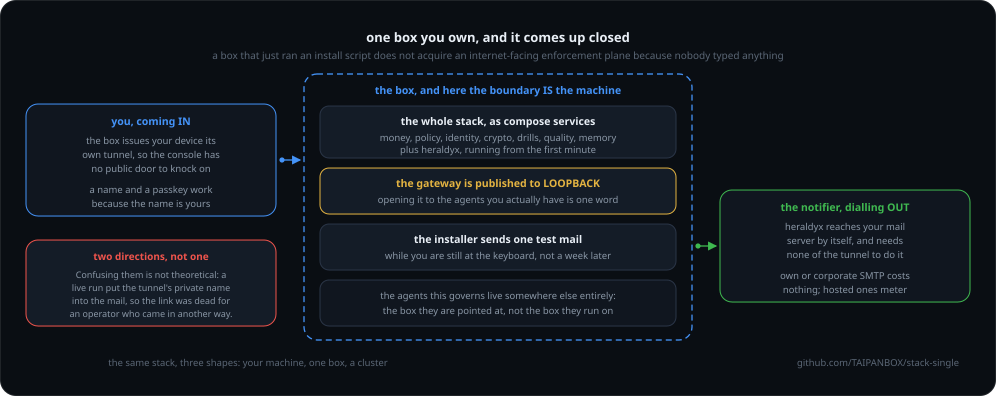
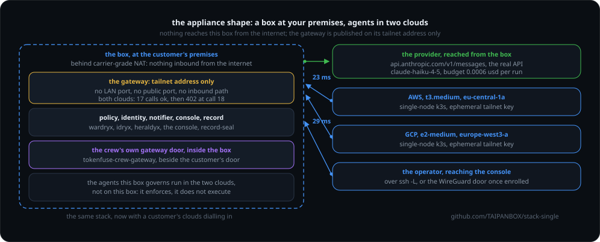

# The agent stack on one machine

One command puts the whole governed stack on a box you own, ready for agents
that live somewhere else entirely.

```bash
curl -fsSL https://raw.githubusercontent.com/TAIPANBOX/stack-single/main/install.sh | bash
```

<div align="center">



</div>

It comes up closed. The gateway is published to the host's **loopback**, so a
box that just ran an install script does not acquire an internet-facing
enforcement plane because nobody typed anything. Opening it to the agents you
actually have is one word:

```bash
GATEWAY_BIND=0.0.0.0 ./install.sh
```

Then point an agent at the gateway. Wherever that agent runs, in EKS, in a CI
job, on a laptop, its calls are metered, budgeted and policy-checked:

```bash
ANTHROPIC_BASE_URL=http://<your box>:4100
```

On a box that is already installed, edit `GATEWAY_BIND` in
`/opt/agent-stack/.env` and `docker compose up -d`. Re-running the installer
will NOT widen it: `.env` is left alone once it exists, which is the same
property that stops a re-run rotating your credentials.

## This is not the sandbox

[`stack-up`](https://github.com/TAIPANBOX/stack-up) is the local try: it binds
`127.0.0.1` on purpose, needs Rust, Go and Node on your machine, and stops when
you press Ctrl-C. It says as much about itself, and it is right to.

This is the other thing. The differences are the whole point:

| | `stack-up` | here |
|---|---|---|
| Reachable by an agent elsewhere | no, and it cannot be | yes, one variable away |
| Toolchains on your host | Rust, Go, Node, Python | docker and git |
| Where the planes come from | compiled on your machine | pulled from ghcr.io, pinned |
| Survives a reboot | no | yes |
| Console sign-in | no console at all | generated, shown once |
| Credentials | a dev key | unique per box, 0600, never printed twice |
| Governance routines on a schedule | all five, as OS timers | none, see below |

That "yes" is measured once, 2026-09-17: on a gateway bound to the box's
tailnet address, the first reboot came back failed and the fix described
below made the second succeed in 40 s; the default loopback bind has not
yet been rebooted under measurement.

## What this box does not run

Two things a look at `compose.yaml` alone will not tell you, both about
absence rather than presence. An operator choosing between the three
deployment shapes (`stack-up`, this one, `stack-k8s`) should be able to see
both before installing, not after.

**No governance routines run on a schedule.** `stack-up`'s `routines.sh`
installs five OS-native timers for the stack's own recurring governance work:
a FinOps export, a crypto-inventory trend, a quality-drift check, an
identity-anomaly sweep, and an opt-in fire drill. `stack-k8s` runs three of
those as CronJobs (`crypto-trend`, `quality-drift`, `identity-sweep`; its own
docs explain why the fourth, the FinOps export, cannot run as a CronJob
there). Neither `install.sh` nor `compose.yaml` installs anything of the
kind: this box runs **none of the five, ever, on its own.** Run one by hand
inside the console container when you want it:

```bash
docker compose exec console verdryx drift --baseline <id>   # or qryx, ...
```

One of the five is defined here as a service you START rather than one that
loops, because a loop is impossible for it and not merely unwanted. The identity
sweep runs on the idryx image, which is distroless: there is no shell for a
`sleep` loop, the binary is `/usr/local/bin/service` rather than `idryx`, and
`detect` has no `--interval`. So it takes the shape stack-k8s already uses for
the one job that must never start because a manifest was applied, and a person
runs it:

```bash
docker compose run --rm idryx-detect
```

It sits behind a `manual` profile that no install enables, which
`scripts/manifest-is-true.sh` checks in both halves: the profile has to be there,
and `install.sh` must never pass it. Put that line in your own cron if you want
it hourly.

or add your own cron entry on the host calling `docker compose exec`. This
was not a documented choice before now; it is simply what the installer and
the compose file do, and it is worth knowing before you pick this shape over
the other two.

**The memory plane, `engram`, is not a separate service here**, the same way
`verdryx`, `qryx` and `mockryx` are not: `compose.yaml` names no `engram`,
`verdryx`, `qryx` or `mockryx` container, because none of the four is meant
to be one. `stack-k8s`'s own README explains why (its "Fact 2"): the console
reaches each of them by EXECUTING it, or, for `engram-mcp` specifically, by
speaking MCP over stdio to a child process, and "a sidecar container cannot
be another container's stdin." So all four have to live inside the console's
own image or not run at all.

They do live there. `install.sh` clones `verdryx` and `engram` as sources
(the same `for r in ... verdryx engram` loop that clones every other plane,
above) and builds the console from the identical
`stack-k8s/images/console.Dockerfile` that bakes both into `stack-k8s`'s
console image, the same `pip install` step and all. Based on reading that
build, not on having run it: the underlying binaries appear to be present
here exactly the way they are in `stack-k8s`'s console, which is a different
claim from "the memory plane works here", and both stacks share the same
further gate regardless of deployment shape: `genaryx`'s own discovery code
(`memory/env.rs`) refuses to show a Memory panel until its store already has
a file with real data in it, so a console that has never actually run an
Engram session reports "no memory plane" on `stack-up`, here, and on
`stack-k8s` alike, until an operator does something once. If there is a
concrete reason this box's memory plane cannot work that a closer look would
find, it is not in `install.sh`, `compose.yaml`, or the Dockerfile it builds
from.

## Reaching the console: this box issues your device its own tunnel

The console is on loopback, so it is reached over a tunnel rather than exposed.
This box runs the WireGuard side itself: sign in, open Remote, and it mints
your laptop or phone a peer config as a QR. Scan, connect, and the console
answers over HTTPS on the name it was configured with, inside that tunnel and
nowhere else - see the next section, because that name is not optional if you
want passkeys to work at all.

Issuing a device and revoking one both require a passkey, the same ceremony a
kill, a budget change or an approval decision does: a peer config is a road
into the control plane, so a stolen console session must not be able to mint
one quietly. Your first device is issued by `install.sh` itself, not the
browser: a passkey cannot be enrolled before a tunnel exists, so the browser
has nothing to issue the first device from. Every device after that goes
through the console once you have one.

The sequence for your first session:

1. import the `.conf` file `install.sh` printed the path to (or scan the QR
   it printed on that run) into your WireGuard client, and connect
2. open `https://<your CONSOLE_DOMAIN>`, trusting this box's own CA first if
   you did not set `CLOUDFLARE_API_TOKEN` (see the next section)
3. sign in with the password `install.sh` printed
4. enrol a passkey under Session > Passkeys

Only after step 4 do kill, budget, approval and device commands work.

SSH is still how you read the console before the tunnel exists, not how you
act on it: a passkey cannot be enrolled over an SSH forward, because WebAuthn
checks the origin, and that forward is `http://localhost`, never your console
domain.

```bash
ssh -L 17420:127.0.0.1:7420 root@<your box>
```

**Alerts do not need any of this.** The notifier dials outward to your mail
server; the tunnel exists to let you IN. A box with no tunnel and no device
still writes to you when one of your agents crosses a line. What the tunnel
decides is only whether the one link in that mail can be opened.

So the link is settable, in `.env`:

```
ALERT_CONSOLE_URL=''                        # use CONSOLE_DOMAIN, i.e. the tunnel
ALERT_CONSOLE_URL='http://localhost:17420'  # you reach the console over ssh -L
```

Leave it empty with no tunnel either, and the mail says it carries no link
rather than carrying a dead name.

Two details worth knowing rather than discovering:

- `51820/udp` is published, and it is the one port here that has to be. Unlike
  an HTTP plane, WireGuard answers nothing at all without a valid key: no
  banner, no handshake, nothing for a scanner to find.
- The tunnel runs in its own `wg` container because it needs `NET_ADMIN` and a
  tun device. The console holds neither: it manages peers through a
  group-readable UAPI socket on a shared volume. That split is checked by the
  installer from the console's side, because a tunnel that is up while the
  console cannot reach its socket looks perfectly healthy from outside.

## Giving the console a real name, so passkeys work

The tunnel is enough to reach the console, and not enough to secure it. A
passkey ceremony cannot run at `https://10.9.0.1` no matter how it is
configured: WebAuthn requires a secure context AND refuses a bare IP as the
party it binds credentials to. So the console needs a name and a certificate,
even though nothing outside your tunnel can reach it.

Out of the box you get a working TLS console on a private name with Caddy's own
CA. That is fine for one operator who does not mind trusting that CA on each
device, and wrong for anything else, because such a CA can issue a certificate
for ANY name to a device that trusts it.

A real name costs two values in `.env` and nothing else:

```bash
CONSOLE_DOMAIN=something-unguessable.box.example.com
CLOUDFLARE_API_TOKEN=<a token scoped to Zone:DNS:Edit on that one zone>
```

Then `docker compose up -d caddy console`. Caddy switches from its internal CA
to Let's Encrypt on its own, and the console's WebAuthn identity follows the
same name, so the relying party, the origin and the address you type are one
value instead of three kept in agreement by hand.

Four things worth knowing before you do it:

- **The A record points at `10.9.0.1`**, the tunnel address, and must be **DNS
  only** (grey cloud). A proxied record cannot reach a private address. Public
  DNS pointing at a private IP is normal and is how every "reach my private
  thing by name" product works.
- **DNS-01, not HTTP-01.** The box publishes nothing on 80/443 and should not,
  so there is nothing for an HTTP challenge to answer. DNS-01 proves ownership
  with a TXT record, which works for a machine the internet cannot reach.
- **Pick an unguessable name.** The record is public, so anyone can learn that
  the name exists. `console.example.com` is an invitation to scan;
  `e02-k7m2.box.example.com` is a string with no value to anyone.
- **A passkey is bound to the name.** Changing the domain later invalidates
  every passkey enrolled at the old one; they must be enrolled again. Nothing
  is lost, but do not discover it during an incident.

Remove the token later and Caddy quietly falls back to its internal CA, which
breaks passkeys again. If you set it, leave it.

## What comes up

Ten containers on one Docker network, plus a one-shot `init-volumes` that
exits, wired exactly as the Kubernetes deployment wires them, because service
names resolve the same way in both:

| Service | Port | Published to a host port |
|---|---|---|
| `tokenfuse-gateway` | 4100 | **yes**, `GATEWAY_BIND` decides where: loopback by default |
| `tokenfuse-cloud` | 8080 | no |
| `wardryx` | 8090 | no |
| `idryx` | 8081 | no |
| `policy-db` (postgres) | 5432 | no |
| `console` | 7420 | loopback only |
| `caddy` | 443 | no, it is reached over the tunnel, on the name in `CONSOLE_DOMAIN` |
| `wg` | 51820/udp | **yes**, and it is the one port here that has to be |
| `heraldyx` | none | it has none. It reads the event volume read-only and dials your mail server, so nothing ever calls it |
| `agent-conform` | none | it has none. It re-checks the hash chain of every event stream every five minutes and writes one file of its own on the bus. See "The chain verifier" below |
| `scopyx` | none | **opt-in, off unless you ask for it.** Inside the compose network only. See below |
| `typryx` | none | **opt-in, off unless you ask for it.** Inside the compose network only. See below |
| `tokenfuse-mcp-broker` | 4200 | **opt-in, off unless you ask for it.** `GATEWAY_BIND` decides where, same as the gateway. See below |
| `typryx-wardryx-proxy` | none | **opt-in twice, off unless you ask for it** (typed answers on, and `TYPED_RISK_SIGNAL=1`). Reachable only from the broker and wardryx. See "A risk signal on tool calls" below |
| `vouchryx` | none | **opt-in, off unless you ask for it.** Inside the compose network only. See "Delegation" below |
| `costcrew` | 8321 | **opt-in, off unless you ask for it** (profile `finops`; `install.sh` never starts it). Loopback only. See "The FinOps console" below |

The gateway's own observability and kill routes (`/v1/runs`, `/v1/keys` and
three more) take a per-install admin key: `GATEWAY_ADMIN` in `.env`, minted
by `install.sh` and presented by the console as `TOKENFUSE_GATEWAY_ADMIN_KEY`.
A request with no key, or the wrong one, is refused. Widening `GATEWAY_BIND`
no longer widens those routes to anyone without the key: it decides who can
reach the port, the key decides who those five routes answer once reached.

Clearing a run's taint label is a sixth door with a key of its own. The
gateway's `POST /v1/fuse/declassify` (the release valve for its agent firewall:
a person reviews a run and the label comes off it) is not behind the admin key.
It takes `x-fuse-declassify-key`, and `install.sh` mints that key into `.env` as
`GATEWAY_DECLASSIFY_KEY`, handed to the gateway as `TOKENFUSE_DECLASSIFY_KEY`.
Without a key configured, the gateway lets anything that reaches the port clear
a run, so this is set by default and only whoever can read `.env` holds it.
Nothing in this stack calls the endpoint. To clear a run, read the key from
`.env` and send it in that header; a call with no key or the wrong one is
refused. An install from before this release gets the key on its next run of
the installer, which adds it without touching any credential already there.

### The most one run can be allowed to spend

A run's budget used to be whatever the agent said: it sends
`x-fuse-budget-usd`, and its next call could widen it again. The gateway
(tokenfuse 1.5.0) now clamps a budget that came from that header, from a policy
default or from its own built-in default to one figure, on every call, and
tells the caller when it did by adding `x-fuse-budget-clamped: <figure>` to the
answer. The figure is **5.00 USD** unless you say otherwise, which is
tokenfuse's own default run budget, so an ordinary run is untouched and only an
agent that declares more is lowered. A budget you set in the Cloud is your own
word and is never clamped, and a caller may always ask for less.

```bash
RUN_BUDGET_CEILING_USD=25 ./install.sh      # a positive number of dollars, at most six decimals
```

On an installed box, set `RUN_BUDGET_CEILING_USD` in `/opt/agent-stack/.env` and
`docker compose up -d`. The installer refuses a value the gateway would refuse
to start on (zero, a sign, an exponent, a seventh decimal), before it touches
the box, and also one already left in `.env`. It bounds one run, not an agent:
an agent that opens a new run id gets a new run's worth, which only unit caps
or a budget tied to an identity close. `install.sh` checks the gateway's own
start-up line to see the clamp is armed, so a gateway older than 1.5.0 turns
that check red instead of reading as bounded.

### The chain verifier

Every writer on the shared events bus chains its lines (`prev_hash`) so a
rewritten line shows. Until `agent-conform watch-dir` nothing on a box ever
looked: on the 2026-09-17 appliance run one byte flipped on a sealed line of the
bus was seen by nothing. The `agent-conform` service now re-verifies every
stream every five minutes, and for a break it has not announced it appends one
`chain_broken` event (high) to its own stream, `agent-conform.ndjson`, which the
notifier already reads. A stream with no chain at all is reported once as low
(`chain_unchained`), never as a break.

It runs as its own account, outside the group every plane writes the bus in, so
it can read every stream and write exactly one file, the one the installer made
for it; it cannot append to another plane's stream or create a file there. Its
memory of what it already announced is on a volume of its own, so clearing the
bus does not re-send old alerts. If it cannot do its job (an unreadable bus) it
exits and compose restarts it, which is how a verifier that is not verifying
shows.

What it does not do: it cannot tell a forged but well-chained line from a real
one, it does not see truncation from the end of a file, and what the notifier
mails for a `chain_broken` today is neutral (the agent, "an event this build
has no description for", the kind `prev_hash_mismatch`): it does not name the
stream or the line, which are in `agent-conform.ndjson` and in the verifier's
own log (`docker compose logs agent-conform`).

"Not published" is not a firewall rule that might be misread: those services
have no host port at all, so nothing outside this machine can address them.

### The one service that does not start

`scopyx`, the web-egress enforcement point, is behind a compose profile:

```bash
docker compose --profile egress up -d scopyx
```

Everything else here governs what your agents do to your own planes. This one
governs what they do to the **outside**, which means that once it runs, agents
on this box can reach the public web on 80 and 443 through it. That is the
widest grant this stack has, and an installer that switched it on without asking
would have made the one decision an operator most needs to have made themselves.

`install.sh` has already put a credential and a per-hour cap in `.env`, so
turning it on is the flag above and nothing else. Every fetch through it is
decided by `wardryx` before anything leaves, every redirect hop is decided
again, and both the fetch and any refusal are written to a chained journal on
its **own** volume, never the shared event log.

Without the credential it refuses to start rather than running open, and that is
deliberate: a wide bind with no credential is an unauthenticated fetch proxy,
and anything that reached it could fetch under your egress allowance and with
your name on the record.

#### If your agents need pages that assemble themselves

The default fetcher runs no JavaScript, so a page built in the browser arrives
as the shell that builds it. There is a second profile with a real browser:

```bash
WITH_BROWSER=1 ./install.sh        # pulls the chromium image, once
docker compose --profile egress-browser up -d scopyx-browser
```

**Use one profile or the other, never both.** They answer to the same name on
the compose network, and running both would give the gateway two services
called `scopyx` and no way to say which one it reached.

It costs about **1 GB** of disk against **15 MB**, which is why it is a
separate profile rather than a variable. The transfer is 267 MB against 3.5 MB,
because this box pulls both. Everything else is identical: the same policy
plane, the same journal on the same volume, the same cap.

It is also the only backend that decides the other requests a page makes, and
there are more of them than the phrase suggests: measured on a real node on
2026-08-10, a Wikipedia article made 40, `bbc.com/news` 113, a GitHub
repository page 144 and `nytimes.com` 343, every one of them decided.
The browser is launched with no route to the network except a proxy scopyx
owns, and that proxy refuses any destination your policy did not allow.

**About the sandbox**, because it will come up. Chromium's renderer sandbox
needs kernel features a container does not give it by default, and it refuses
to start rather than quietly running without one. This profile keeps Chrome's
sandbox and relaxes the container's syscall filter (`seccomp:unconfined`),
which is the better trade here: with Chrome's sandbox off, an exploit in a
hostile page runs as the container's user and can open sockets directly, and
that is egress that never passes the proxy and never reaches the record. If
your policy is the other way round, set `SCOPYX_CHROMIUM_NO_SANDBOX=1` in
`.env` and drop the `security_opt` line.
The console is on loopback because it arrives over your own tunnel:

```bash
ssh -L 17420:127.0.0.1:7420 root@<your box>
open http://localhost:17420
```


## The record: what this box did, sealed

Off unless you ask for it, like the egress plane above.

```bash
WITH_RECORD=1 ./install.sh                        # pulls the record plane
docker compose --profile record up -d record-seal
```

It reads every `*.ndjson` on the shared event bus, appends what is new to a
hash-chained store of sealed segments, packs the whole ledger and verifies the
pack before it sleeps. Daily by default, `RECORD_SEAL_INTERVAL` in seconds to
change that.

**One value you have to set, and nothing here can guess it.** Unlike the local
sandbox, this deployment governs whatever fleet you point at it, so it does not
know the domain your agents mint their ids under:

```bash
RECORD_TRUST_DOMAIN=your-domain.example    # in .env
```

Leave it and the seal refuses rather than pretending. `--trust-domain` takes
one value and every id outside it is refused, so a wrong domain would seal
nothing and report a clean run. It tells you instead, naming how many ids it
saw and which prefix it was looking for. A partial match is fine and does not
refuse: a box governing more than one domain is a normal thing to be.

The store lives on its own volume, not on the bus. That is deliberate and it is
gated: a record kept where its own inputs live is evidence you can delete while
clearing space on the thing it is evidence about.

## Typed answers: was the task actually met

Off unless you ask for it, like the egress plane above.

```bash
WITH_TYPED=1 ./install.sh
```

pulls the typed-answer plane and tokenfuse's MCP broker in front of it, and
brings both up: this is the one opt-in profile this launcher starts on its
own rather than leaving for a second manual command. Without the flag, bring
either or both up by hand:

```bash
docker compose --profile typed up -d typryx
docker compose --profile typed up -d typryx tokenfuse-mcp-broker
```

`typryx` answers a typed question (a choice, a score, a yes or no) from one
of three templates baked into its image, with a probability for every
option, and scores those probabilities against truths recorded later. `install.sh` has already put a credential in `.env`, so turning it
on is the flag above and nothing else; without the credential it refuses to
start, the same stance scopyx takes.

**`WITH_TYPED=1` on its own gives the `stub` backend**: free, deterministic,
no outbound call, exactly as before `TYPED_MODE` existed. The image also
carries `openai-logprobs`, which asks any OpenAI-compatible model server for
its token probabilities, and `jev`, a hosted service. Choosing one of those is
a decision about where your data goes, so it has its own section below:
[Typed answers: choose where your data goes](#typed-answers-choose-where-your-data-goes).

`@decided 2026-09-26`: the journal joins the shared `events` volume now that
typryx's four event types (`typed_answer`, `typed_unanswered`,
`typed_refused`, `calibration_drift`) are registered in agent-passport's
SPEC 6.2. heraldyx reads the whole event directory, so it can alert on them;
`record-seal` counts all four refused rather than sealing them: they carry
agent-event v1.0, a schema trailryx 1.0 does not read (`unknown_schema`), and
past the schema trailryx refuses these four types by name on purpose, since an
answer to a question is not a decision the agent took (trailryx#81). The ledger (typryx's own answer/outcome store,
not an agent-event stream) stays on its own volume.

### Reaching it through tokenfuse's MCP broker

`tokenfuse-mcp-broker` runs the same pinned tokenfuse image as the gateway,
one subcommand, `mcp-broker`, unchanged: typryx joins it entirely by
configuration, never by a code change in either repository. It publishes on
`${GATEWAY_BIND:-127.0.0.1}:4200`, the identical expression the gateway's own
port uses, so it is closed by default the same way and widens with the same
one variable.

An agent reaches typryx at `http://<this box>:4200/mcp`, with the header
`X-Fuse-Mcp-Upstream: typryx` naming which plane the broker forwards to, and
its own client key (`TOKENFUSE_MCP_KEYS` in `.env`) as `x-fuse-key`. A
`tools/call` carries the typed-plane credential the broker injects, not a key
the caller ever sees:

```json
{"_meta": {"typryx/key": "{{secret:typryx_key}}"}}
```

`install.sh` prints the URL and the header names at the end of a run with
`WITH_TYPED=1`; it never prints a key's value.

**Measured end to end** (typryx v0.2.0, tokenfuse
v1.1.1; this launcher now pins typryx v0.4.0), live on Docker Desktop on 2026-09-26: an `ask` whose typryx key
travelled only as `{{secret:typryx_key}}` through the broker was answered,
typryx wrote its `typed_answer` to the shared bus under the key's agent with
the caller's `run_id`, the broker wrote its own `tool_call`, a wrong key was
refused `401`, and neither key appeared in either container's log. The same
call against typryx v0.1.0 is refused `401`: reading the key from `_meta` is
typryx#6, first released in v0.2.0. `install.sh`'s own check `an ask through
the broker is answered` repeats this on every install.

### A risk signal on tool calls (opt-in, off by default)

`@claude` 2026-10-04, from the estate audit's launcher spec: wardryx 1.2.0 can
hold a tool call for a person when a typed fact about it says so (a signal may
hold a call and never deny it), and typryx 0.4.0 can supply the fact. With typed
answers on, one more word turns it on:

```bash
WITH_TYPED=1 TYPED_RISK_SIGNAL=1 ./install.sh            # the stub backend: shows the wiring, classifies nothing
TYPED_MODE=own-model TYPED_MODEL_URL=http://host.docker.internal:11434/v1 \
  TYPED_MODEL_NAME=qwen2.5:7b TYPED_RISK_SIGNAL=1 ./install.sh
```

`TYPED_RISK_SIGNAL=0` turns it off again; with typed answers off the flag is
refused, naming what to set, before anything is installed. What it starts:
`typryx wardryx-proxy`, in front of wardryx, for the MCP broker alone. The
broker asks wardryx about every `tools/call` before it injects a secret; the
proxy asks typryx `action.risk_class` about that call (from the tool, its
arguments and its target, nothing else) and adds the answer to the request as a
signal. The LLM gateway keeps asking wardryx directly: a model call has no
pending tool call to classify, and typryx's latency does not belong in front of
a path with a 250 ms deadline.

**Nothing holds a call until you write the rule.** This launcher seeds no
`hold_if_signal` policy. To hold the calls typryx is at least 80% sure are
destructive, an external send or a payment, add this to `/opt/agent-stack/policy.yaml`
(your own trust domain in `target`) and `docker compose restart wardryx`:

```yaml
- name: hold-risky-tool-calls
  target: "agent://<your trust domain>/*"
  hold_if_signal:
    name: action.risk_class
    values: [destructive, external_send, financial]
    min_probability: 0.8
```

A signal can add a hold and nothing else: wardryx refuses a rule that would deny
on one, and no answer in time, an unanswered or a refusal sends the call on
untouched. A held call returns an approval id and is released by the person who
approves it in the console.

What turning it on changes, so nobody is surprised:

- **The broker becomes a policy enforcement point.** It was not one: on this
  launcher it never asked wardryx anything. Now every tool call is decided
  under your whole `policy.yaml`, a call with no `x-fuse-agent-id` header is
  refused (it cannot be judged), and with wardryx or the proxy unreachable the
  call is refused (fail closed, like the gateway).
- **A paid backend is asked once per tool call**, whatever your policy reads.
  typryx caps its own calls per hour (1000 by default); a spent cap just stops
  signals being added. With `jev` that is metered at TypeSafe.
- **Each ask waits at most 3 seconds** (`TYPED_RISK_ASK_TIMEOUT_MS` in `.env`,
  1 to 5000). typryx's own default of 150 ms is shorter than a hosted model
  answers (about 230 ms measured for Jev) and far shorter than a model on a CPU
  (about 2100 ms), so at that default a real backend would almost never be heard.
  A late answer is dropped, so a slow model means no signal, not a slow call.
- **The proxy is open on purpose, and a network is what closes it.** The broker
  cannot send it a credential, so it runs without one, on a Docker network
  (`risk-signal`) that holds only the proxy, the broker and wardryx, with no
  published port. It must never be put on the default network: every container
  there could then spend your ask budget. `scripts/typed-risk-signal.sh` holds
  that, and `install.sh` checks it from both sides (reachable from its own
  network, not from the default one, not on the host).
- **The stub backend's answer is a fixed pick, not a classification.** It proves
  the wiring end to end, and holds a call only if you write a rule for the value
  it picks.

Measured, live, on Docker Desktop 2026-10-04 through this repository's own
`compose.yaml` and the `.env` this installer writes, stub backend: a tool call
through the broker carried an `action.risk_class` signal from typryx into
wardryx and into the decision event on the bus; with a `hold_if_signal` rule
for the value the stub picks, the same call was held with an approval id. Not
measured: a real backend, the signal under load, or `install.sh` itself on
Debian (CI runs it, with the stub, on every change).

## Typed answers: choose where your data goes

`@decided 2026-09-30`: typed answers come from exactly one of three places,
and you pick which. The installer never picks for you, and a question's data
only ever goes where the mode you chose says.

| `TYPED_MODE` | Where the answer comes from | What leaves this box | What you must give it |
|---|---|---|---|
| `jev` | TypeSafe's hosted Jev API | The fields each question's template names, and the question's instructions, go to `api.typesafe.ai`. Nothing else in the state does. Metered by TypeSafe. | `TYPED_JEV_KEY_FILE`: the **path** of a file holding your Jev key |
| `own-model` | A model server you run, Ollama or vLLM | Nothing leaves your own hardware. Questions go to the server you name and to no other address. | `TYPED_MODEL_URL` (an OpenAI-compatible base URL ending in `/v1`) and `TYPED_MODEL_NAME`; optionally `TYPED_MODEL_KEY_FILE` |
| `off` | Nobody | Nothing. typryx is not installed and the stack is what it was without it. **This is the default.** | Nothing |

`WITH_TYPED=1` with no `TYPED_MODE` keeps what it has always done: typryx on
its stub backend, which makes no outbound call. That is the one path that does
not ask you to choose, and it exists so nobody's existing install changes.

```bash
# your own model, here an Ollama on this box (nothing leaves the machine)
TYPED_MODE=own-model TYPED_MODEL_URL=http://host.docker.internal:11434/v1 \
  TYPED_MODEL_NAME=qwen2.5:7b ./install.sh

# Jev, with the key in a file you keep yourself
TYPED_MODE=jev TYPED_JEV_KEY_FILE=/root/jev.key ./install.sh

# explicitly none
TYPED_MODE=off ./install.sh
```

Run on a terminal with none of these set, the installer asks the same question
(`jev / own-model / off`, one line on what leaves the box for each) and records
the answer, so the next run does not ask again. With no terminal it asks
nothing: the environment is the only way to choose. An existing box keeps its
mode on a re-run; to change it, run the installer again with the new
`TYPED_MODE` (and its variables), which replaces the old mode's settings rather
than adding to them.

**It refuses before it touches anything.** `jev` with no key file, a missing or
empty one, or a key pasted where the path goes; `own-model` with no URL, a URL
that does not end in `/v1`, or no model name: each stops the installer with a
message naming what is missing, before a package is installed or a file is
written. A refusal never echoes what you typed, so a key given in the wrong
place is not printed.

**A key is only ever a file.** The installer copies your key file into
`./typed` (mode 0400, owned by the user typryx runs as), and compose mounts that
directory read only at `/run/typed`. `.env` and `docker compose config` name the
path inside the container and never carry the key: it is not an environment
value, it is not printed, and it is not logged. To rotate a key, run the
installer again with the new file.

`own-model` also sets typryx's per-question time limit to 30 seconds
(`TYPED_MODEL_TIMEOUT_MS` to change it). typryx's own default is 2 seconds, and a
7B model on a CPU answers in about that long, so left at the default most
answers would time out. On Linux the installer also makes `host.docker.internal`
resolve inside the typryx container, so the URL above reaches a server on this
same box.

`jev` is left unpriced here: this launcher wires no prices anywhere else, so
typryx's cost reporting for Jev stays at zero until you set
`TYPRYX_JEV_PRICE_PER_MTOK_INPUT` in `.env` yourself (and add it to the
`typryx` service's environment in `compose.yaml`; it is not passed through
today). The installer's own end-of-run check skips the ask through the broker in
`jev` mode, because that ask would go to TypeSafe, and spend, on every run.

### What the choice costs in accuracy

`@measured` 2026-09-30, one frozen 434-question test (typryx-evalset), each
mode asked the same questions:

| | Accuracy | Calibration error (ECE) | Median answer time |
|---|---|---|---|
| `jev` | 87.1% | 0.042 | 229 ms |
| `own-model`, qwen2.5:7b through `openai-logprobs`, on an 8-vCPU CPU machine | 70.0% | 0.273 | 2130 ms |

For scale, a constant default answer with no typryx at all scored 25.1% on the
same test. `off` is today's behaviour: no typryx, nothing asked, nothing
measured. The own-model row is one small model on a CPU, an example and not a
ceiling: a larger model, a GPU, or a model fitted to your own questions moves
it, and nothing here measured those.

### Your own model, on your own data

`@decided 2026-09-30`: this stack does not fine-tune or ship models for you. A
customer can fine-tune and calibrate a model of their own on their own data,
and typryx gives them what they need for it: every answer, and the truth
recorded for it later, goes into typryx's ledger, and `typryx calibration`
reports, per template and per model, how far its stated confidence is from how
often it was right. See [typryx's README](https://github.com/TAIPANBOX/typryx#calibration).
Jev's answers are not training data: TypeSafe's terms forbid using Jev output
to train another model, so what you fine-tune on is the truths your own people
post, never what Jev said.

**The opt-in training log.** `@decided 2026-09-30`: typryx can keep a local
training log, off by default. typryx v0.3.0 is the first release that has it and
this launcher pins typryx v0.4.0, so it is there. Switch it on with `TYPED_TRAINING=1` next to any typed mode
(`WITH_TYPED=1`, `TYPED_MODE=jev` or `TYPED_MODE=own-model`):

```bash
TYPED_MODE=own-model TYPED_MODEL_URL=http://host.docker.internal:11434/v1 \
  TYPED_MODEL_NAME=qwen2.5:7b TYPED_TRAINING=1 ./install.sh
```

The installer writes `TYPRYX_TRAINING_DIR=/var/lib/typryx/training` into `.env`:
a private directory (mode 0700, its file 0600) inside the `typryxdata` volume,
the same volume as typryx's ledger. The ledger is on in this launcher already,
and it is where the human truths live, which the export needs. Without
`TYPED_TRAINING=1` nothing names that variable, nothing is written, and `.env`
is exactly what it was. A re-run with nothing set keeps the log on, a change of
mode keeps it, and `TYPED_TRAINING=0` turns it off (the log already on disk
stays until you delete it). It needs typryx installed: `TYPED_TRAINING=1` with
typed answers off is refused before anything is touched.

Each answered, templated question appends one line holding the state that
actually went to the model (the fields the template names, never the rest) and
the answer's identity. It holds neither the model's answer nor its
probabilities. Post the truth a person decided for an answer to `/v1/outcome`,
then export the pairs:

```bash
(umask 077; docker compose --profile typed exec -T typryx typryx export --training > train.jsonl)
```

Every row is `{"template","template_version","type","state","label"}`, and
`label` is the human truth as posted. The counts of what was skipped (no truth
yet, a changed template, a duplicate) go to stderr. The data stays on this box:
the log lives in a Docker volume and the export is a file you write on the host.
The export carries human truths only, never a model's answer, because TypeSafe's
terms forbid using Jev output to train another model; what you fine-tune on is
what your own people judged. Fine-tuning, serving the tuned model behind
`TYPED_MODEL_URL`, and comparing it with `typryx calibration` are yours and
happen outside this stack. The log has no rotation or retention: it grows until
you remove it, and it holds your questions, so treat the volume as data you own.

## The appliance shape: a box at your premises, the agents in two clouds

<div align="center">



</div>

On 2026-09-17 this launcher was proven in the shape an operator actually
wants: a box at a premises, closed to the internet, with agents dialling in
from elsewhere. The evidence is public in
[`estate-gates/PROVEN.md`](https://github.com/TAIPANBOX/estate-gates/blob/main/PROVEN.md),
the nine rows dated that day.

**What was installed.** v1.1.3 from this repository, on a Debian 13
(trixie) mini PC that already had Docker CE 29.8.1 and Compose v5.5.1, with
`GATEWAY_BIND` set to the box's tailnet address and `WITH_RECORD=1`. Phase A
ran in 61 s: 22 checks ok and check 1 FAIL by construction, because it
probed loopback whatever `GATEWAY_BIND` said (fixed by #59). A second run
added a compose override for the appliance shape itself (the crew's own
door, client keys and an identity map on the customer door, the notifier to
a file, a record seal every 120 s): 36 s, the same 22 ok.

**Before phase A**, `apt-get install -s docker-buildx` on that box answered
`Remv docker-ce`: the distro's own package would have removed Docker CE.
The run held the Docker packages and pinned Debian's `docker-buildx` out
instead. Fixed by #59: every `apt-get install` here now carries
`--no-remove`, and buildx is asked for only when missing, as
`docker-buildx-plugin` beside `docker-ce`.

**Two customer clusters**, a single-node k3s on a GCP `e2-medium` and one
on an AWS `t3.medium`, joined the tailnet with an ephemeral key each and
reached the gateway from a pod: direct WireGuard paths of 23 ms (AWS) and
29 ms (GCP). Both agents ran 17 calls at `200` and were then refused with
`402 budget_exceeded` from call 18 onward, interleaved on one bus; the box
told the two clouds apart by key and by id.

**The reboot.** With the gateway bound to a tailnet address, the first
reboot brought it back as `Exited (128)`: Docker programmed the bind
before `tailscaled` held the address, the failed start was never retried,
and a later `up -d` started the container with no port mapping. Fixed on
the box with `net.ipv4.ip_nonlocal_bind = 1` and a `docker.service`
drop-in ordered after `tailscaled`, and proven by a second reboot, the
gateway back on its own in 40 s. Both are what `install.sh` section 4b now
writes (#59).

**The control plane's own events file.** On v1.1.3 the control plane could
not create `tokenfuse-cloud.ndjson` (it runs as uid 10001, gid 999, against
a `root:10001 2775` directory) and said nothing about it, so no
control-plane incident, `budget_exhausted` among them, reached the
notifier or the record. Now pre-created by `init-volumes` and named by
`TOKENFUSE_EVENTS_PATH` (#59 here; the image side is tokenfuse#303).

**Teardown.** Both cloud accounts were verified empty by direct query
afterwards: about 63 VM-minutes per cloud, and about USD 0.18 for the whole
day. The box's own stack is still what this README installs.

**What this run did not prove.** A reboot on the default loopback bind
(never measured); managed clusters; arm64 for this shape; mail delivery
beyond the file transport; the passkey ceremony; the WireGuard door
reached from outside the LAN; `down -v`; a full disk; a lost `.env`.

## What the installer will not do quietly

It verifies itself and tells you what it found. Three of its checks have to
FAIL to pass: the money plane, the policy plane and the store must not be
reachable from the host. Three more test the CREDENTIAL rather than the port,
because a plane with a malformed key spec starts cleanly, stays reachable and
authenticates nobody: the admin key must get 200, an unknown key 401, and the
gateway's own key 403 when it tries to read policy. And one reads back the
rule Docker actually wrote for port 4100, rather than trusting the variable
that was supposed to produce it. A green install with an open plane is the outcome
worth designing against.

A gateway published on one address that is not loopback (a tailnet address,
say) needs two things from the host that the installer writes rather than
leaves for the first reboot to reveal: `net.ipv4.ip_nonlocal_bind = 1` in
`/etc/sysctl.d/90-agent-stack-bind.conf`, so Docker can bind the address
before the host holds it, and, where `tailscaled.service` exists, a
`docker.service` drop-in that starts Docker after tailscaled. Without them the
gateway came back from a reboot as `Exited (128)` and was never retried, and a
later `up` said `Started` of a container with no port mapping, which is why
one check now reads the mapping from `docker port` rather than believing
`Started`. If either file cannot be written the installer refuses and says so;
a bind changed by hand in `.env` afterwards gets them on the next run.

If the console source is not present it says so and installs the governed
stack without it, which is a real deployment: the planes enforce with or
without a UI in front of them.

One thing it does not check, said here rather than found later. The
`events` volume is shared by every plane that writes the bus, group-writable
so each can append its own file. Since heraldyx 0.3.0 and idryx 1.1.0 a line is
read as the source its FILE may carry (`wardryx.ndjson` carries `wardryx`,
`tokenfuse-cloud.ndjson` and `tokenfuse-mcp.ndjson` carry `tokenfuse`), so a
line claiming another plane inside the wrong file is refused and said once; the
file names this installer writes are held to that by `scripts/bus-names-match-their-source.sh`.
What is still open: any writer in the bus group can append to any other plane's
file under that file's own source, and the record plane takes a line as that
plane's word. The containers sharing that volume trust each other as much as
they trust the box.

The other thing this used to say here, delegation being verified nowhere on
this box, is the gap the next section closes.

## Delegation: a proved chain instead of a claimed one

Off unless you ask for it, like the egress plane above.

```bash
WITH_DELEGATION=1 ./install.sh
```

Without this, an agent's `on_behalf_of` is a claim the caller wrote: nothing
on this box checks it, and a policy that asks for a proven chain
(`deny_if_chain_unproven`) refuses only callers honest enough to say they did
not prove it. `vouchryx`, the delegation plane, exchanges a subject token, an
actor token and a DPoP proof for a short-lived JWT the gateway can verify,
and answers `GET /v1/revocations` so a delegation can be ended before it
expires, not only recorded.

**What turning this on buys, and what it does not.** The gateway starts
verifying the `cnf.jkt`-bound chain a token actually proves, instead of
trusting whatever `x-fuse-on-behalf-of` a caller sent. It does not mint
tokens for you, and it does not pick your identity provider: vouchryx
exchanges a subject and actor token it was handed, it does not issue the
first one.

**Enabling it needs a real trusted issuer.** `install.sh` refuses before
anything starts, naming what is missing, unless one of these is true:

- `VOUCHRYX_TRUSTED_ISSUERS` names the upstream identity provider your
  agents actually get their subject and actor tokens from, one
  `iss|aud|jwks-path` per line, the `jwks-path` a file readable inside
  `./delegation` once the run finishes. There is no safe value to invent
  here, so nothing does.
- or `WITH_DELEGATION_DEMO_ISSUER=1`, a clearly-labelled, self-signed issuer
  this installer mints for you to try the wiring with. **This is never a
  production posture**: nothing verifies that a self-signed demo issuer is
  who it says it is, because nothing can, by construction.

**The signing key and the revocation key are generated once**, into
`./delegation` (the directory 0700 and the keys 0600, owned by the uid
vouchryx runs as, so no other container can enter it; the gateway reads only
the public JWKS, from `./delegation-public`), and reused on
every later run, exactly like every other credential `.env` holds. Neither
is ever printed. Revocations persist on their own volume, not the shared
`events` bus, so clearing the bus never quietly un-revokes a delegation, and
a plain `docker compose down` never loses one either.

**vouchryx is never published to the host**, the same posture as the money
and policy planes: the gateway reaches it, and polls
`GET /v1/revocations`, over the compose network only. `POST /v1/revoke`
needs `VOUCHRYX_REVOKE_KEYS` from `.env` as a bearer key and is reached the
same way, from a container on this compose network, not the host; this
launcher does not yet wire the console's own revoke button
(`GENARYX_VOUCHRYX_URL`, `GENARYX_VOUCHRYX_REVOKE_KEY_FILE`) the way
`stack-up`'s does.

**What this does not cover.** It verifies a chain a caller presents; it does
not decide what a proven chain is allowed to do; that is `wardryx`'s policy,
unchanged by this. It does not run the hand-off (delegate-of-a-delegate)
path or Cross App Access; both exist in vouchryx and neither is wired here.

## The FinOps console (CostCrew), optional

Off, and nothing here turns it on for you. `install.sh` does not know it exists:
no flag, no profile, no line. A box that never enables it runs exactly what it
ran without it, and `scripts/finops-is-opt-in.sh` holds that. To turn it on,
once, on a box that is already installed:

```bash
cd /opt/agent-stack
docker compose --profile finops up -d costcrew
```

That pulls one image, `ghcr.io/taipanbox/costcrew:v0.4.0`, and starts it beside
a small one-shot that prepares its volume. It is the FinOps console: cloud and
AI spend, a crew of agents that triages it, and a person who reviews what the
crew wrote.

**Before it starts, it wants a name.** The console writes an Agent Passport for
each of its agents, and a passport needs an owner, so it refuses to start
without one and says so in its log. The owner is `COSTCREW_OWNER` in `.env`,
and if that is not set, the address your alerts go to (`ALERT_TO`). Set one
before the command above, or the container will restart and complain. Its
agents also mint their ids under `RECORD_TRUST_DOMAIN`, the same value the
record plane takes (see "The record" above), so that the seal accepts what the
console reports instead of counting it foreign.

**Reaching it.** The console is on `127.0.0.1:8321` of the box and nowhere else.
It is not behind the tunnel and not behind Caddy, which serves one site, the
main console. Reach it the way you reach that one before a tunnel exists:

```bash
ssh -L 8321:127.0.0.1:8321 root@<your box>
open http://localhost:8321
```

Give yourself a password first, from the box, before you open it:

```bash
docker compose --profile finops exec costcrew /usr/local/bin/costcrew \
  -data /var/lib/costcrew -set-password ops:<a real password>
```

The password is visible in your shell history and in the process list for as
long as that command runs. The first start also fills the console with a
generated estate so there is something to look at; it is not a bill of yours.
It answers `/healthz` with 200 and no redirect; from the compose network that
is `docker run --rm --network agent-stack_default busybox:1.36 wget -q -O - http://costcrew:8321/healthz`.

**What it does here.** Its events go to the shared bus as `costcrew.ndjson`, so
the notifier can mail about them and the chain verifier checks them. It runs as
a user of its own that can write that one file on the bus and nothing else
there, with a read-only root filesystem, a 128 MB temporary directory in
memory at `/tmp` (SQLite needs one to compact its database), and no
capabilities.

**What it does not do.** As shipped it cannot spend: no gateway is wired to it,
which is what lets its planning calls reach a model, and the crew runner in the
same image is not started. Sending its calls through this box's gateway is a
decision about money and is yours to take, separately. The notifier does not
read its passports, so an alert about one of its agents names the agent and not
the person who answers for it.

**Moving to a newer console.** The pin is `ghcr.io/taipanbox/costcrew:v0.4.0`.
On a box that already ran the earlier pin, the same `up -d costcrew` picks it
up, and four things change. Everybody signs in again once, because sessions
are now stored hashed and the old ones are ended at the first start. The
console's database (with its `-wal` and `-shm`) and its journal become 0600;
the volume's directory keeps the 0750 the one-shot gave it, and
`costcrew.ndjson` on the bus stays 0644 so the chain verifier can still read
it. A request body over 1 MiB is refused with 413. The image now carries five
binaries (`costcrew-usage` is new); none of the new flags is required and none
is passed here. If you later wire it to a gateway, give every analyst an owner
first: behind a gateway, an analyst with no owner is refused before the call.
The first start after the upgrade also compacts the database so the old
session tokens leave the file, which needs that temporary directory. With a
`compose.yaml` older than the one that added it, the console instead logs one
warning that the database could not be vacuumed: the old session rows are gone
from the table, but their bytes may remain in the file's free space.

Turn it off with `docker compose --profile finops stop costcrew`. Its data stays
in the `costcrewdata` volume until you remove that volume yourself.

## The console

All of it is Apache-2.0 and public, the console included: Genaryx went open on
2026-07-27 and there is no longer a closed piece here. The installer clones
[`genaryx`](https://github.com/TAIPANBOX/genaryx) like anything else, and needs
no token.

`CONSOLE_TOKEN` and the `src/genaryx-a360` drop-in still work and are still
useful, but for a different reason now: they let you install a build of your
own rather than reach GitHub at all.

Felyx, the console's copilot, asks its model through this box's own gateway,
under `agent://<RECORD_TRUST_DOMAIN>/genaryx/felyx`, so its questions are
metered and policy-checked like any agent's calls. It ships without a key: put
your provider key in `.env` as `GENARYX_COPILOT_KEY` and run
`docker compose up -d console`. Until then Felyx says it is not configured and
the rest of the console works as before.

## Traps, already fixed here

The Kubernetes sibling of this repo,
[`stack-k8s`](https://github.com/TAIPANBOX/stack-k8s), keeps a `GOTCHAS.md`
with every trap both deployments hit. These are the ones a first install would
have walked straight into, closed here rather than left for you:

- `install.sh` writes `.env` and then sources it, so every value in it is
  shell. From v1.1.9 to v1.1.12 one default carried an unquoted `|`, the shell
  ran the words after it as commands, and every install stopped at that line.
  The value is quoted now, and a `.env` one of those releases wrote is repaired
  before it is sourced, so a box that installed one can simply re-run.
- Both planes take a bearer-key spec of the form `key:org[:role]`, and an entry
  without the `:org` half parses to **zero** valid keys. The plane then starts
  cleanly, stays reachable, and authenticates nobody. Every health check passes
  while the money plane is deaf.
- The client side of each plane takes the bare key, not the spec, and the
  gateway's key on the policy plane is a `viewer` on purpose: `/v1/decide`
  needs no more, and an enforcement point that can rewrite the policy it
  enforces is not one.
- Kubernetes has `fsGroup` for volume ownership and Compose has nothing. A
  fresh named volume is `root:root`, so the policy plane cannot write its own
  event file and the gateway drops every trace behind a single WARN. A one-shot
  init service does what `fsGroup` would.
- The identity plane loads the gateway's event log at startup and treats an
  absent file as fatal, which on a box that has served no traffic it always is.
- The money plane binds loopback by default, which inside a container means
  unreachable; the distro's `docker.io` package ships without buildx; and the
  Go builder image is older than some of the repos it compiles.

## Licence

Apache 2.0. See [LICENSE](LICENSE).
